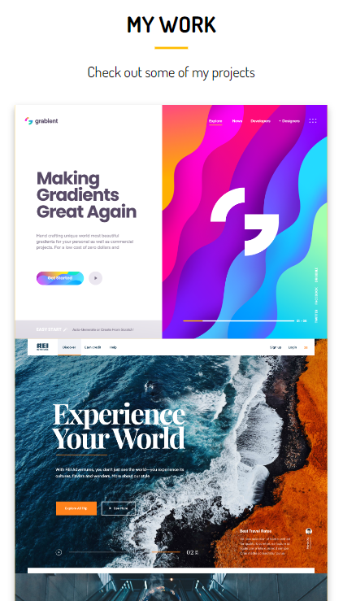
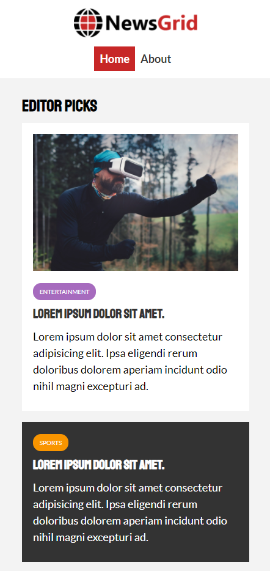
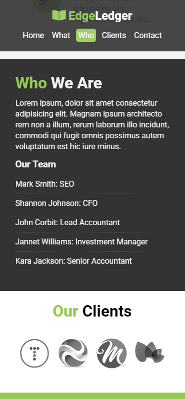
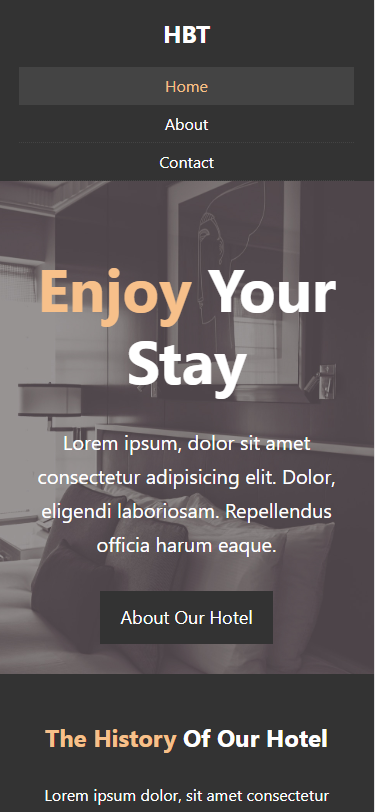

## <a href="https://ilyakozak.github.io/css-templates/portfolio-website/dist/"> Template | Portfolio Website </a>

#### <a href="https://github.com/IlyaKozak/css-templates/tree/master/portfolio-website"> github </a>

 
based on https://www.udemy.com/modern-html-css-from-the-beginning/

---

## <a href="https://ilyakozak.github.io/css-templates/newsgrid/"> Template | NewsGrid </a>

#### <a href="https://github.com/IlyaKozak/css-templates/tree/master/newsgrid"> github </a>

 
based on https://www.udemy.com/modern-html-css-from-the-beginning/

---

## <a href="https://ilyakozak.github.io/css-templates/lp-template-company%20(with%20flex)/"> Landing Page | Template | Company (with Flex) </a>

#### <a href="https://github.com/IlyaKozak/css-templates/tree/master/lp-template-company%20(with%20flex)"> github </a>

 
based on https://www.udemy.com/modern-html-css-from-the-beginning/

---

## <a href="https://ilyakozak.github.io/css-templates/template-hotel-website%20(with%20float)"> Template | Hotel Website (with Float) </a>

#### <a href="https://github.com/IlyaKozak/css-templates/tree/master/template-hotel-website%20(with%20float)"> github </a>

 
based on https://www.udemy.com/modern-html-css-from-the-beginning/

---
